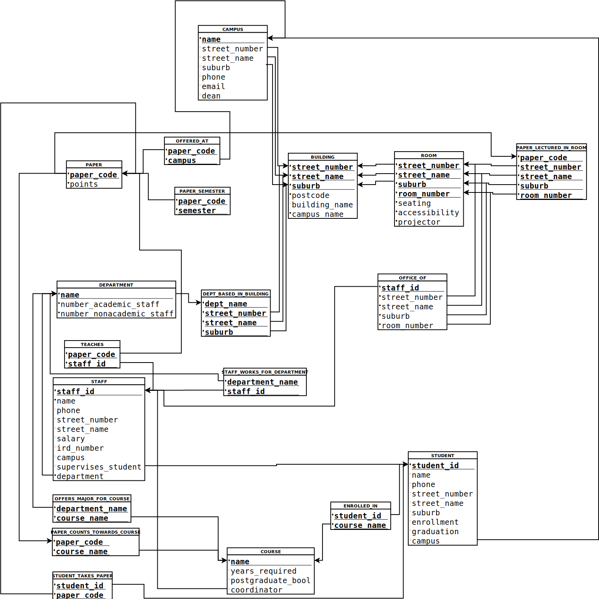

# COSC344 Assignment 2 Report: Mapping and Normalization

Leader: Hayden McAlister

Members: Masaaki Fukushima, Jack Heikell, Nat Moore

## Entity-Relationship Model
- ### Student
| Attribute   | Simplicity  | Num-Values  | Data Type   |
| ----------- | ----------- | ----------- | ----------- |
| Student_ID | Simple, Not NULL | Single-valued | Int (key Attribute) |
| Name | Simple, Not NULL | Single-valued | String |
| Phone | Simple | Single-valued | String |
| Address | Composite (Street_Number: int[1,10000], Street_Name: Str, Suburb: Str) | Multi-valued | String |
| Course | Simple | Multi-valued | String | TODO: By reference?
| Enrollment_Date | Simple, Not NULL | Single-valued | Date |
| Graduate_Date | Simple | Single-valued | Date |
| Graduated_bool | Derived (From existence of Graduate_Date) | Single-valued | Boolean |

- ### Staff
| Attribute   | Simplicity  | Num-Values  | Data Type   |
| ----------- | ----------- | ----------- | ----------- |
| Staff_ID | Simple, Not NULL | Single-valued | Int (Key Attribute) |
| Name | Simple, Not NULL | Single-valued | String |
| Phone | Simple | Single-valued | String |
| Address | Composite (Street_Number: int[1,10000], Street_Name: Str, Suburb: Str) | Multi-valued | String |
| Salary | Simple, Not NULL | Single-valued | Float |
| IRD_Num | Simple, not NULL | Single-valued | Int |

- ### Department
| Attribute   | Simplicity  | Num-Values  | Data Type   |
| ----------- | ----------- | ----------- | ----------- |
| Name | Simple | Single-valued | String (Key Attribute)|
| Campus | Simple | Derived (From Campus Reference) | String |
| Number_of_Employees | Composite (Number_of_academic_staff: int,  Number_of_nonacademic_staff: int) | Single-valued | int |
| Number_of_Students | Derived (from Student references) | Single-valued | int |
| Address | Derived (from Building references) | Multi-valued | String |

- ### Course
| Attribute   | Simplicity  | Num-Values  | Data Type   |
| ----------- | ----------- | ----------- | ----------- |
| Name | Simple | Single-valued | String (Key Attribute) |
| Years_required | Simple | Single-valued | int |
| Undergraduate | Simple | Single-valued | boolean |
| Postgraduate | Simple | Single-valued | boolean |
| Number_of_Students | Derived (from Student references) | Single-valued | int |

- ### Paper
| Attribute   | Simplicity  | Num-Values  | Data Type   |
| ----------- | ----------- | ----------- | ----------- |
| Paper_Code | Simple | Single-valued | String (Key Attribute) |
| Semester | Simple | Multi-valued | String (Enumerated) |
| Points | Simple | Single-valued | Int |  

- ### Campus
| Attribute   | Simplicity  | Num-Values  | Data Type   |
| ----------- | ----------- | ----------- | ----------- |
| Name | Single-valued | Single-valued | String (Key Attribute) |
| Main_Office_Address | Single-valued | Single-valued | String |
| Phone | Simple | Single-valued | String (Candidate Key) |
| Email | Simple | Single-valued | String (Candidate Key) |

- ### Building
| Attribute   | Simplicity  | Num-Values  | Data Type   |
| ----------- | ----------- | ----------- | ----------- |
| Address | Composite (Street_Number: int[1,10000], Street_Name: Str, Suburb: Str) | Single-valued | String (Key Attribute) |
| Postcode | Simple | Single-valued | Int (Four Digit) |
| Name | Simple | Single-valued | String |

- ### Room
| Attribute   | Simplicity  | Num-Values  | Data Type   |
| ----------- | ----------- | ----------- | ----------- |
| Room Number | Simple | Single-valued | Int, [1,10000] (Partial Key)|
| Seating | Simple | Single-valued | Int [1,10000] |
| Accessibility | Simple | Single-valued | Boolean |
| Projector | Simple | Single-valued | Boolean |

# Mapping to Relational Model
---
## Step 1: Mapping Regular Entity Types

### BUILDING
- Decompose composite attribute and add all simple attributes, add weak key to primary key

| <u>Street_Number</u> | <u>Street_Name</u> | <u>Suburb</u> | Postcode | Name |
| ----------- | ----------- | ----------- | ----------- | ----------- |

### DEPARTMENT
| <u>Name</u> | Number_Of_Academic_Staff | Number_Of_Nonacademic_Staff |
| ----------- | ------------------------ | --------------------------- |

### COURSE 
| <u>Name</u> | Years_Required | Postgradute_Bool |
| ----------- | -------------- | ---------------- | 

### PAPER
| <u>Paper_code</u> | Semester (Multi-value) | Points |
| ----------------- | ---------------------- |------- |

### CAMPUS
| <u>Name</u> | Street_Number | Street_Name | Suburb | Phone | Email |
| ----------- | ------------------- | ----- | ----- | ----- | ----- |

### STUDENT
- Decompose composite attributes and add all simple attributes.

| <u>Student_ID</u> | Name | Phone | Street_Number | Street_Name | Suburb | Enrollment | Graduation | Graduated |
| ----------------- | ---- | ----- | ------------- | ----------- | ------ | ---------- | ---------- | --------- |

### STAFF
- Decompose composite attributes and add all simple attributes.

| <u>Staff_ID</u> | Name | Phone | Street_Number | Street_Name | Suburb | Salary | IRD_Num |
| --------------- | ---- | ----- | ------------- | ----------- | ------ | ------ | ------- |

---
## Step 2: Mapping Weak Entity Types

### ROOM
- Add as primary key reference the primary key of building

| <u>Street_Number</u> (REFERENCES Building) | <u>Street_Name</u> (REFERENCES Building)  | <u>Suburb</u> (REFERENCES Building)  | <u>Room Number</u>| Seating | Accessibility | Projector |
| ----------- | ----------- | ----------- | ----------- | ----------- |----------- | ----------- |

---
## Step 3: Mapping of binary 1:1 Relationships

### DEAN_OF (Campus 1:1 Staff)
- The Staff_ID is added to the campus table to represent a DEAN_OF relationship, as campus has total participation. 

##### CAMPUS
| <u>Name</u> | Main_Office_Address | Phone | Email | Dean (REFERENCES Staff) |
| ----------- | ------------------- | ----- | ----- | ------------------------------- |

### COORDINATES (Course 1:1 Staff)
- Staff_ID  is added to course as staff members have total participation in the COORDINATES relationship.

##### COURSE
| <u>Name</u> | Years_Required | Postgradute_Bool | Coordinator_id (REFERENCES Staff) |
| ----------- | -------------- | ---------------- | ------------------------------ |

---
## Step 4: Mapping of Binary 1:N Relationships

### LOCATED_ON (Building N:1 Campus)
- Add as foreign key to Building the primary key of Campus

##### BUILDING
| <u>Street_Number</u> | <u>Street_Name</u> | <u>Suburb</u> | Postcode | Building_Name | Campus_Name (REFERENCES Campus) |
| ----------- | ----------- | ----------- | ----------- | ----------- |----------- |

### OFFICE_OF (Room 1:N Staff)
- Create a new table OFFICE_OF that includes the primary key of staff as primary and foreign key, and primary key of room as foreign key
- This avoids many NULLs for staff with no office

##### OFFICE_OF
| <u>Staff_ID</u> (REFERENCES Staff) | Street_Number (REFERENCES Building) | Street_Name (REFERENCES Building)  | Suburb (REFERENCES Building)  | Room_Number|
| --------------- | ---- | ----- | ------------- | ----------- |

### LOCATED_IN (Room N:1 Building)
- Add as foreign key to Room the primary key of Campus
- Already done in step 2 (weak entity mapping), so no extra work is needed

### STUDENT_AT (Student N:1 Campus)
- Reference for the campus a student is located at/in.

##### STUDENT
| <u>Student_ID</u> | Name | Phone | Street_Number | Street_Name | Suburb | Enrollment | Graduation | Graduated | Campus |
| ----------------- | ---- | ----- | ------------- | ----------- | ------ | ---------- | ---------- | --------- | ------ |

### STAFF_AT (Student N:1 Campus)
- Reference for the campus a staff member is located at/in.

##### STAFF
| <u>Staff_ID</u> | Name | Phone | Street_Number | Street_Name | Suburb | Salary | IRD_Num | Campus |
| --------------- | ---- | ----- | ------------- | ----------- | ------ | ------ | ------- | ------ |

### SUPERVISES (Staff M:1 Student)
- We decided to change this into its own supervises entity, to eliminate excessive NULL's if many students did not have supervisors.

##### STAFF_SUPERVISES_STUDENT
| <u>Staff_ID (REFERENCES Staff)</u> | <u>Student_ID (REFERENCES Student)</u> |
| ---------------------------------- | -------------------------------------- |

	
---
## Step 4.5: Mapping of Binary 2:N Relationships

### ENROLLED_IN (Student 2:N Course)
- Though originally Enrolled_In was going to be handled by data fields within the Student entity, we decided to model enrollment through a separate entity. This is so a student can enroll in more than one course.

##### ENROLLED_IN
| <u>Student_ID</u> | <u>Course</u> |
| ----------------- | ------------- |

---
## Step 5: Mapping of Binary M:N Relationships

### BASED_IN (Building M:N Department)
- Create new Relation with primary key of each related entity

##### DEPT_BASED_IN_BUILDING
| <u>Dept_Name</u> (REFERENCES Department) | <u>Street_Number</u> (REFERENCES Building) | <u>Street_Name</u> (REFERENCES Building)  | <u>Suburb</u> (REFERENCES Building)  |
| ----------- | ----------- | ----------- | ----------- |

### LECTURED_IN (Room M:N Paper)
- Create new Relation with primary key of each related entity

##### PAPER_LECTURED_IN_ROOM
| <u>Paper_Code</u> (REFERENCES Paper) | <u>Street_Number</u> (REFERENCES Building) | <u>Street_Name</u> (REFERENCES Building)  | <u>Suburb</u> (REFERENCES Building)  | <u> Room Number</u> |
| ----------- | ----------- | ----------- | ----------- |----------- |

### WORKS_FOR(Staff M:N Department)
- Create new Relation with primary key of each related entity

- Originally it was decided that staff members could work for multiple departments, but for realism and ease of use, we have since agreed staff members may only work for one department, and combination departments could be added where necessary. A cleaner would work for the cleaning department, rather than each department that they clean, for example. This is represented below:

##### STAFF
| <u>Staff_ID</u> | Name | Phone | Street_Number | Street_Name | Suburb | Salary | IRD_Num | Campus | Supervises_Student (REFERENCES Student) | Department (REFERENCES Department)|
| --------------- | ---- | ----- | ------------- | ----------- | ------ | ------ | ------- | ------ | ---------- | ----- |

### COUNTS_TOWARD(Paper M:N Course)
- Create new Relation with primary key of each related entity

##### PAPER_COUNTS_TOWARD_COURSE
| <u>Paper_Code</u> (REFERENCES Paper) | <u>Course_Name</u> (REFERENCES Course) |
| --------------------------------------- | ----------------------------------------- |

### POSSIBLE_MAJOR_FOR(Department M:N Course)
- Create new Relation with primary key of each related entity 

##### DEPARTMENT_OFFERS_MAJOR_FOR_COURSE
| <u>Department_Name</u> (REFERENCES Department) | <u>Course_Name</u> (REFERENCES Course) |
| ------------------------------------------------- | ----------------------------------------- |

### TEACHES (Staff N:M Paper)
- Relationship refers to the keys of both staff and paper. 

##### TEACHES
| <u>Teaching staff (Staff ID)</u> | <u>Paper (Paper_code)</u> |
| -------------------------------- | ------------------------- |

### OFFERED_AT (Paper N:M Campus)
- Relationship refers to both paper and campus. 

##### OFFERED_AT
| <u>Paper (Paper_Code)</u> | <u>Campus Name</u> |
| ------------------------- | ------------------ |

### TAKES (Student N:M Paper)
- Relationship refers to student and paper. 

##### STUDENT_TAKES_PAPER
| <u>Student_ID</u> | <u>Paper_code</u> |
| ----------------- | ----------------- |

---
## Step 6: Mapping of Multi-valued attributes

##### PAPER_SEMESTERS
| <u>Paper_code</u> | Semester |
| ----------------- | -------- |

##### PAPER
| <u>Paper_code</u> | Points |
| ----------------- | ------ |
- Semesters was previously a multi-valued attribute of paper, as a paper could be taught in multiple semesters. The table was split so one represents a paper and all the semesters it is taught in, and another refers to the paper code and the points associated with it. 

---
## Step 7: Mapping of N-ary Relationship types
- We had no N-ary relationship types to map

---
# Mapped Relational Model 

 

### BUILDING
| <u>Street_Number</u> | <u>Street_Name</u> | <u>Suburb</u> | Postcode | Building_Name | Campus_Name (REFERENCES Campus) |
| ----------- | ----------- | ----------- | ----------- | ----------- |----------- |

### ROOM
| <u>Street_Number</u> (REFERENCES Building) | <u>Street_Name</u> (REFERENCES Building)  | <u>Suburb</u> (REFERENCES Building)  | <u>Room Number</u>| Seating | Accessibility | Projector |
| ----------- | ----------- | ----------- | ----------- | ----------- |----------- | ----------- |

### DEPARTMENT
| <u>Name</u> | Number_Of_Academic_Staff | Number_Of_Nonacademic_Staff |
| ----------- | ------------------------ | --------------------------- |

### DEPT_BASED_IN_BUILDING
| <u>Dept_Name</u> (REFERENCES Department) | <u>Street_Number</u> (REFERENCES Building) | <u>Street_Name</u> (REFERENCES Building)  | <u>Suburb</u> (REFERENCES Building)  |
| ----------- | ----------- | ----------- | ----------- |

### CAMPUS
| <u>Name</u> | Street_Number | Street_Name | Suburb | Phone | Email |
| ----------- | ------------------- | ----- | ----- | ----- | ----- |

### COURSE
| <u>Name</u> | Years_Required | Postgradute_Bool | Coordinator_id (REFERENCES Staff) |
| ----------- | -------------- | ---------------- | ------------------------------ |

### DEPARTMENT_OFFERS_MAJOR_FOR_COURSE
| <u>Department_Name</u> (REFERENCES Department) | <u>Course_Name</u> (REFERENCES Course) |
| ------------------------------------------------- | ----------------------------------------- |

### STUDENT
| <u>Student_ID</u> | Name | Phone | Street_Number | Street_Name | Suburb | Enrollment | Graduation | Graduated | Campus |
| ----------------- | ---- | ----- | ------------- | ----------- | ------ | ---------- | ---------- | --------- | ------ |

### ENROLLED_IN
| <u>Student_ID</u> | <u>Course</u> |
| ----------------- | ------------- |

### STAFF
| <u>Staff_ID</u> | Name | Phone | Street_Number | Street_Name | Suburb | Salary | IRD_Num | Campus (REFERENCES Campus) | Supervises_Student (REFERENCES Student) | Department (REFERENCES Department)|
| --------------- | ---- | ----- | ------------- | ----------- | ------ | ------ | ------- | ------ | ---------- | ----- |

### STAFF_SUPERVISES_STUDENT
| <u>Staff_ID (REFERENCES Staff)</u> | <u>Student_ID (REFERENCES Student)</u> |
| ---------------------------------- | -------------------------------------- |

### PAPER
| <u>Paper_code</u> | Points |
| ----------------- | ------ |

### PAPER_SEMESTERS
| <u>Paper_code</u> | Semester |
| ----------------- | -------- |

### PAPER_COUNTS_TOWARD_COURSE
| <u>Paper_Code</u> (REFERENCES Paper) | <u>Course_Name</u> (REFERENCES Course) |
| --------------------------------------- | ----------------------------------------- |

### OFFERED_AT
| <u>Paper (Paper_Code)</u> (REFERENCES Paper) | <u>Campus Name</u> (REFERENCES Campus) |
| ------------------------- | ------------------ |

### PAPER_LECTURED_IN_ROOM
| <u>Paper_Code</u> (REFERENCES Paper) | <u>Street_Number</u> (REFERENCES Room) | <u>Street_Name</u> (REFERENCES Room)  | <u>Suburb</u> (REFERENCES Room) | <u> Room Number</u> (REFERENCES Room) |
| ----------- | ----------- | ----------- | ----------- |----------- |

### STUDENT_TAKES_PAPER
| <u>Student_ID</u> (REFERENCES Student) | <u>Paper_code</u> (REFERENCES Paper) |
| ----------------- | ----------------- |

### TEACHES
| <u>Teaching staff (Staff ID)</u> | <u>Paper (Paper_code)</u> |
| -------------------------------- | ------------------------- |

### OFFICE_OF
| <u>Staff_ID</u> (REFERENCES Staff) | Street_Number (REFERENCES Building) | Street_Name (REFERENCES Building)  | Suburb (REFERENCES Building)  | Room_Number|
| --------------- | ---- | ----- | ------------- | ----------- |
# Normalization

## 1NF
Definition: All values are atomic
- This is true from the mapping process from ERD to Relational Model
- The multi-value attribute of papers, semesters, is already converted to be atomic. 

---
## 2NF
Definition: 1NF and every non-key attribute is fully dependent on the primary key

### BUILDING
- Postcode is dependent only on street name and suburb, but not street number
- Remove postcode to its own entity, make a foreign key reference

##### BUILDING
| <u>Street_Number</u> | <u>Street_Name</u> (REFERENCES postcode) | <u>Suburb</u> (REFERENCES postcode) | Building_Name | Campus_Name (REFERENCES Campus) |
| ----------- | ----------- | ----------- | ----------- | ----------- |

##### POSTCODE
| <u>Street_Name</u> | <u>Suburb</u> | Postcode |
| ----------- | ----------- | ----------- |

---
## 3NF
Definition: 2NF and no non-prime attribute is transitively dependent on the primary key

---
## BCNF
Definition: 3NF and for every non-trivial functional dependency X->A, X is a superkey of R

---

# Normalized Relational Model 

 

### POSTCODE
| <u>Street_Name</u> | <u>Suburb</u> | Postcode |
| ----------- | ----------- | ----------- |

### BUILDING
| <u>Street_Number</u> | <u>Street_Name</u> (REFERENCES postcode) | <u>Suburb</u> (REFERENCES postcode) | Building_Name | Campus_Name (REFERENCES Campus) |
| ----------- | ----------- | ----------- | ----------- | ----------- |

### ROOM
| <u>Street_Number</u> (REFERENCES Building) | <u>Street_Name</u> (REFERENCES Building)  | <u>Suburb</u> (REFERENCES Building)  | <u>Room Number</u>| Seating | Accessibility | Projector |
| ----------- | ----------- | ----------- | ----------- | ----------- |----------- | ----------- |

### DEPARTMENT
| <u>Name</u> | Number_Of_Academic_Staff | Number_Of_Nonacademic_Staff |
| ----------- | ------------------------ | --------------------------- |

### CAMPUS
| <u>Name</u> | Main_Office_Address | Phone | Email | Dean (REFERENCES Staff) |
| ----------- | ------------------- | ----- | ----- | ------------------------------- |

### COURSE
| <u>Name</u> | Years_Required | Undergraduate | Postgraduate | Coordinator (REFERENCES Staff) |
| ----------- | -------------- | ------------- | ------------ | ------------------------------ |

### STUDENT
| <u>Student_ID</u> | Name | Phone | Street_Number | Street_Name | Suburb | Enrollment | Graduation | Graduated | Campus |
| ----------------- | ---- | ----- | ------------- | ----------- | ------ | ---------- | ---------- | --------- | ------ |

### ENROLLED_IN
| <u>Student_ID</u> | <u>Course</u> |
| ----------------- | ------------- |

### STAFF
| <u>Staff_ID</u> | Name | Phone | Street_Number | Street_Name | Suburb | Salary | IRD_Num | Campus (REFERENCES Campus) | Supervises_Student (REFERENCES Student) | Department (REFERENCES Department)|
| --------------- | ---- | ----- | ------------- | ----------- | ------ | ------ | ------- | ------ | ---------- | ----- |

### STAFF_SUPERVISES_STUDENT
| <u>Staff_ID (REFERENCES Staff)</u> | <u>Student_ID (REFERENCES Student)</u> |
| ---------------------------------- | -------------------------------------- |

### DEPT_BASED_IN_BUILDING
| <u>Dept_Name</u> (REFERENCES Department) | <u>Street_Number</u> (REFERENCES Building) | <u>Street_Name</u> (REFERENCES Building)  | <u>Suburb</u> (REFERENCES Building)  |
| ----------- | ----------- | ----------- | ----------- |

### DEPARTMENT_OFFERS_MAJOR_FOR_COURSE
| <u>Department_Name</u> (REFERENCES Department) | <u>Course_Name</u> (REFERENCES Course) |
| ------------------------------------------------- | ----------------------------------------- |

### PAPER
| <u>Paper_code</u> | Points |
| ----------------- | ------ |

### PAPER_SEMESTERS
| <u>Paper_code</u> | Semester |
| ----------------- | -------- |

### PAPER_COUNTS_TOWARD_COURSE
| <u>Paper_Code</u> (REFERENCES Paper) | <u>Course_Name</u> (REFERENCES Course) |
| --------------------------------------- | ----------------------------------------- |

### OFFERED_AT
| <u>Paper (Paper_Code)</u> (REFERENCES Paper) | <u>Campus Name</u> (REFERENCES Campus) |
| ------------------------- | ------------------ |

### PAPER_LECTURED_IN_ROOM
| <u>Paper_Code</u> (REFERENCES Paper) | <u>Street_Number</u> (REFERENCES Room) | <u>Street_Name</u> (REFERENCES Room)  | <u>Suburb</u> (REFERENCES Room) | <u> Room Number</u> (REFERENCES Room) |
| ----------- | ----------- | ----------- | ----------- |----------- |

### STUDENT_TAKES_PAPER
| <u>Student_ID</u> (REFERENCES Student) | <u>Paper_code</u> (REFERENCES Paper) |
| ----------------- | ----------------- |

### TEACHES
| <u>Teaching staff (Staff ID)</u> | <u>Paper (Paper_code)</u> |
| -------------------------------- | ------------------------- |

### OFFICE_OF
| <u>Staff_ID</u> (REFERENCES Staff) | Street_Number (REFERENCES Building) | Street_Name (REFERENCES Building)  | Suburb (REFERENCES Building)  | Room_Number|
| --------------- | ---- | ----- | ------------- | ----------- |

## TEAMWORK SUMMARY
- ### Hayden McAlister
    - Created template for report format
    - Mapped entities and relationships related to Building, Room
    - Created SQL for tables originating from Building, Room
    - Compiled teams report+SQL fragments into single documents with similar styles
    - Tested combined SQL

- ### Nat Moore
    - Mapped entities and relationships related to Department, Course
    - Created SQL for tables originating from Department, Course

- ### Jack Heikell
    - Mapped entities and relationships related to Student, Staff
    - Created SQL for tables originating from Student, Staff
    - Updated some aspects of Course (and related) tables in SQL

- ### Masaaki Fukushima
    - Mapped entities and relationships related to Paper, Campus
    - Created SQL for tables originating from Paper, Campus
